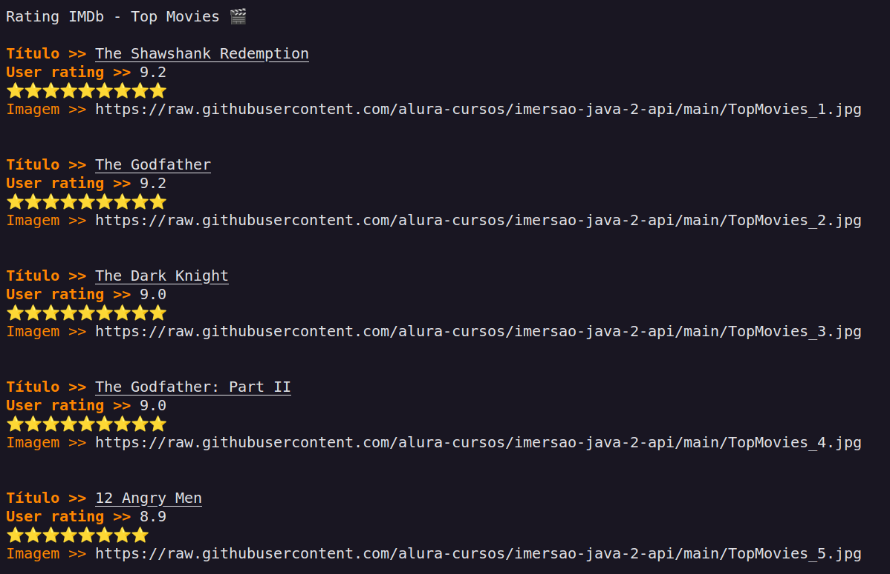

<h1 align="center"> IMDb - Top MOvies 🎬 </h1>

<h2 align="center"> Imersão Java - Alura </h2>

Evento exclusivo e gratuito, promovido pela Alura para ensino da linguagem JAVA.

  <a href="#-tecnologias">Tecnologias</a>&nbsp;&nbsp;&nbsp;|&nbsp;&nbsp;&nbsp;
  <a href="#-projeto">Projeto</a>&nbsp;&nbsp;&nbsp;|&nbsp;&nbsp;&nbsp;
  <a href="#-layout">Layout</a>&nbsp;&nbsp;&nbsp;|&nbsp;&nbsp;&nbsp;
  <a href="#memo-licença">Licença</a>

  

 

  

## 🚀 Tecnologias

Esse projeto foi desenvolvido com as seguintes tecnologias:

- JAVA
- Json
- Http
- ANSI escape code (decorar o terminal com cores e emojis)

Link para acessar a API do IMDb: [LINK](https://imdb-api.com/api).

## 💻 Projeto

Aplicação do zero para consumir a API do IMDb e exibir os filmes mais populares, destacando seus pôsteres e visualizando sua classificação.

## 🔖 Resultado

  

## :memo: Licença

Esse projeto está sob a licença MIT.

---

Feito por Júlia Freitas - [Contato](juliafreitas20177@gmail.com)
